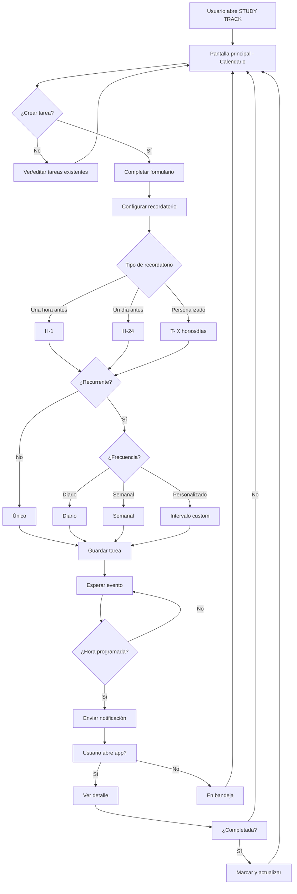

# STUDYTRACK

## Descripcion del Proyecto

**STUDYTRACK** es una aplicación móvil diseñada para estudiantes que se les dificulta la gestión de su tiempo de estudio, causando sobrecarga académica, atrasos y procrastinación. La app permite registrar tareas y evaluaciones en un calendario interactivo, asignar fechas límite y recibir notificaciones de recordatorio, mejorando el rendimiento aadémico mediante una organización efectiva.

## Características Propias del Movil

La solución aprovecha las siguientes capacidades del móvil:

- **Ubicuidad**: Acceso desde cualquier lugar sin necesidad de una computadora o laptop pesada. 

- **Notificaciones Push**: Alertas automáticas para recordar fechas límite y hábitos de estudio.

- **Personalización**: Configuración de horarios y preferencias de recordatorios.

- **Modo Offline**: Visualización y edición básica sin conexión a internet. 

## Requerimientos

### Historias de Usuaio

| ID | Historia de Usuario
|----|--------------------|
| HE-01 | Como estudiante, quiero registrar un título, descripción y fecha límite para no olvidar mis tareas. |
| HE-02 | Como estudiante, quiero ver mis tareas en un calendario mensual para visualizar mi carga académica. |
| HE-03 | Como estudiate, quiero recibir notificaciones de recordatorio personalizadas a la tarea para organizar el orden y tiempo que les dedico. |
| HE-04 | Como estudiante, quiero marcar tareas como completadas para hacer seguimiento de mi progreso. |
| HE-05 | Como estudiante, quiero editar y eliminar tareas en caso de cambio en mis fechas de evaluación. |

### Requerimientos Funcionales

- **RF-01**: El sistema debe permitir crear, leer, actualizar y eliminar tareas.

- **RF-02**: El sistema debe mostrar un calendario interactivo con las tareas asignadas a cada fecha.

- **RF-03**: El sistema debe enviar notificaciones push en fechas y horas configurables.

### Requerimientos No Funcionales

- **RNF-01**: La aplicación debe funcionar sin conexión a internet.

- **RNF-02**: Las notificaciones deben entregarse con un retraso máximo de 5 segundos respecto a lo programado.

- **RNF-03**: La aplicación debe estar disponible para iOS y Android con el mismo código base.

## Diagrama de Caso de Uso Principal

**Caso de Uso Principal**: Registrar Nueva Tarea y Configurar Notificación

## Investigación

Este proyecto incluye un análisis de aplicaciones similares y el detalle técnico de implementación de las funcionalidades móviles.

📄 [Ir a RESEARCH.md](./RESEARCH.md)

