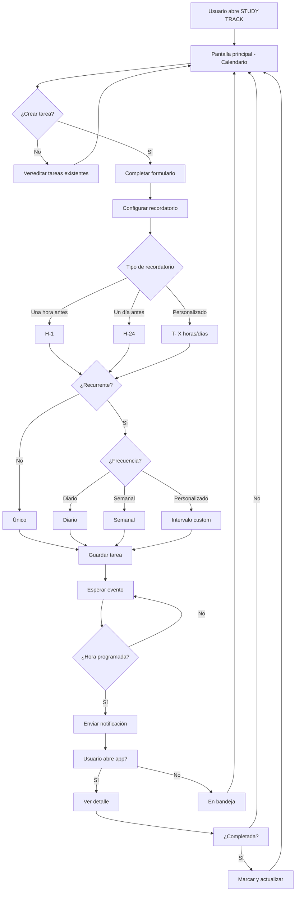

# STUDYTRACK

## Descripcion del Proyecto

**STUDYTRACK** es una aplicación móvil diseñada para estudiantes que se les dificulta la gestión de su tiempo de estudio, causando sobrecarga académica, atrasos y procrastinación. La app permite registrar tareas y evaluaciones en un calendario interactivo, asignar fechas límite y recibir notificaciones de recordatorio, mejorando el rendimiento aadémico mediante una organización efectiva.

## Características Propias del Movil

La solución aprovecha las siguientes capacidades del móvil:

- **Ubicuidad**: Acceso desde cualquier lugar sin necesidad de una computadora o laptop pesada. 

- **Notificaciones Push**: Alertas automáticas para recordar fechas límite y hábitos de estudio.

- **Personalización**: Configuración de horarios y preferencias de recordatorios.

- **Modo Offline**: Visualización y edición básica sin conexión a internet. 

## Requerimientos

### Historias de Usuaio

| ID | Historia de Usuario
|----|--------------------|
| HE-01 | Como estudiante, quiero registrar un título, descripción y fecha límite para no olvidar mis tareas. |
| HE-02 | Como estudiante, quiero ver mis tareas en un calendario mensual para visualizar mi carga académica. |
| HE-03 | Como estudiate, quiero recibir notificaciones de recordatorio personalizadas a la tarea para organizar el orden y tiempo que les dedico. |
| HE-04 | Como estudiante, quiero marcar tareas como completadas para hacer seguimiento de mi progreso. |
| HE-05 | Como estudiante, quiero editar y eliminar tareas en caso de cambio en mis fechas de evaluación. |

### Requerimientos Funcionales

- **RF-01**: El sistema debe permitir crear, leer, actualizar y eliminar tareas.

- **RF-02**: El sistema debe mostrar un calendario interactivo con las tareas asignadas a cada fecha.

- **RF-03**: El sistema debe enviar notificaciones push en fechas y horas configurables.

### Requerimientos No Funcionales

- **RNF-01**: La aplicación debe funcionar sin conexión a internet.

- **RNF-02**: Las notificaciones deben entregarse con un retraso máximo de 5 segundos respecto a lo programado.

- **RNF-03**: La aplicación debe estar disponible para iOS y Android con el mismo código base.

## Diagrama de Caso de Uso Principal

**Caso de Uso Principal**: Registrar Nueva Tarea y Configurar Notificación

```mermaid
graph TD
    A[Usuario abre STUDY TRACK] --> B[Pantalla principal - Calendario];
    B --> C{¿Crear tarea?};
    
    C -->|No| D[Ver/editar tareas existentes];
    D --> B;
    
    C -->|Sí| E[Completar formulario];
    E --> F[Configurar recordatorio];
    
    F --> G{Tipo de recordatorio};
    
    G -->|Una hora antes| H[H-1];
    G -->|Un día antes| I[H-24];
    G -->|Personalizado| J[T- X horas/días];
    
    H --> K{¿Recurrente?};
    I --> K;
    J --> K;
    
    K -->|No| L[Único];
    K -->|Sí| M{¿Frecuencia?};
    
    M -->|Diario| N[Diario];
    M -->|Semanal| O[Semanal];
    M -->|Personalizado| P[Intervalo custom];
    
    L --> Q[Guardar tarea];
    N --> Q;
    O --> Q;
    P --> Q;
    
    Q --> R[Esperar evento];
    R --> S{¿Hora programada?};
    
    S -->|Sí| T[Enviar notificación];
    S -->|No| R;
    
    T --> U[Usuario abre app?];
    U -->|Sí| V[Ver detalle];
    U -->|No| W[En bandeja];
    
    V --> X[¿Completada?];
    X -->|Sí| Y[Marcar y actualizar];
    X -->|No| B;
    
    Y --> B;
    W --> B;
```

## Investigación

Este proyecto incluye un análisis de aplicaciones similares y el detalle técnico de implementación de las funcionalidades móviles.

📄 [Ir a RESEARCH.md](./RESEARCH.md)


## Instrucciones de Uso

- **1** : Al abrir la aplicación, se mostrará la pantalla principal (Home), donde se presenta una vista general de la aplicación y sus funciones principales.

- **2** : Desde la pantalla inicial, el usuario podrá acceder a las distintas secciones mediante los botones de navegación disponibles.

### 3 : Sección Calendario:
    - Permite visualizar fechas importantes relacionadas con actividades académicas.
    - Próximamente incorporará tareas organizadas por día.

### 4 : Sección Tareas:
    - Muestra una lista de tareas pendientes y completadas.
    - Permite revisar entregas próximas y organización personal.

- ### 5: Sección Acerca de :
    - Presentación de información general del proyecto y sus principales características

- **6** : Para desplazarse entre pantallas, utilice los botones del menú o los accesos disponibles en cada vista.

- **7** : El botón flotante con símbolo + permitirá agregar nuevas tareas o eventos en futuras versiones.

## Arquitectura y Patrones

### Arquitectura del Proyecto

La aplicación STUDYTRACK está desarrollada utilizando el framework Flutter y sigue una arquitectura modular basada en la separación de responsabilidades.

La estructura del proyecto se organiza de la siguiente manera:

```text
lib/
├── models/
│   └── task.dart
├── ui/
│   ├── screens/
│   │   ├── calendar_screen.dart
│   │   ├── tasks_screen.dart
│   │   ├── task_detail_screen.dart
│   │   ├── about_screen.dart
│   │   ├── help_screen.dart
│   │   └── profile_screen.dart
│   └── widgets/
│       ├── task_card.dart
│       └── feature_card.dart
└── main.dart
```
###  Justificación de la estructura

#### models/
Contiene la representación de datos del sistema:
- **Ejemplo:** `Task`
- Define atributos como título, descripción y fecha límite
- Independiente de la UI

Esto permite que la lógica de datos pueda reutilizarse o cambiar su fuente (por ejemplo, base de datos o API) sin afectar la interfaz.

#### ui/screens/
Contiene todas las pantallas principales de la aplicación. Cada archivo representa una vista completa:
- `calendar_screen.dart` → vista principal (Home)
- `tasks_screen.dart` → lista de tareas
- `task_detail_screen.dart` → detalle de tarea
- `about_screen.dart`, `help_screen.dart`, `profile_screen.dart` → pantallas informativas

Separar por pantallas mejora la organización y facilita la navegación.

#### 🔹 ui/widgets/
Contiene componentes reutilizables:
- `task_card.dart` → representación visual de una tarea
- `feature_card.dart` → elementos informativos

 Evita duplicación de código y mantiene consistencia visual.

#### 🔹 main.dart
Punto de entrada de la aplicación:
- Configura el tema global (ThemeData)
- Define rutas nombradas (routes)
- Controla la navegación principal

### Patrón de Diseño

Se aplica una arquitectura inspirada en separación por capas (similar a MVVM simplificado):

| Capa | Ubicación |
|------|-----------|
| **Modelo (Model)** | `models/` |
| **Vista (View)** | `screens/` y `widgets/` |
| **Control de navegación y estado básico** | `main.dart` + `Navigator` |

Aunque no se implementa un ViewModel formal, la separación permite escalar fácilmente hacia patrones más robustos en el futuro (Provider, Riverpod, BLoC).

### Jerarquía de Navegación

La aplicación utiliza navegación basada en **rutas nombradas** mediante el widget `Navigator` de Flutter.

#### Ruta inicial

La pantalla principal es el calendario

Estructura de Navegación:

```text
Calendar (Home)
 ├── Tasks
 │    └── Task Detail
 ├── About
 ├── Profile
 └── Help
```

##### Tipo de Navegación
    - Navegación No Lineal
    - Acceso a Múltiples Pantallas Desde la Barra Superior (AppBar)
    - Uso de Navigator.pushNamed para transiciones

Esto permite que el usuario pueda moverse libremente entre secciones sin seguir un flujo rigido

#### Justificación de la navegación

| Beneficio | Explicacion
|----|--------------------|
| Acceso rápido | Todas las pantallas son accesibles desde el AppBar |
| Experiencia flexible | El usuario no depende de un flujo secuencial |
| Escalabilidad | Se pueden agregar nuevas rutas fácilmente en main.dart |	

#### Decisiones técnicas clave
- Uso de rutas nombradas para centralizar la navegación

- Separación clara entre datos (models) y UI (screens/widgets)

- Componentización mediante widgets reutilizables

- Estructura preparada para futuras mejoras:

- Integración de base de datos (Hive/sqflite)

- Notificaciones push (flutter_local_notifications)

- Manejo de estado avanzado (Provider, Riverpod, BLoC)

## Material de Apoyo

https://youtu.be/nnMGWF5fdSc

## APK

El APK de la aplicación está disponible en la raíz del repositorio para instalación directa en Android.

**Archivo:** `studytrack-v1.0.0.apk`

Para generar un nuevo APK desde el código fuente:

```bash
flutter build apk --release --target-platform android-arm64
```

> Para instalar el APK en un dispositivo Android ve a **Ajustes → Aplicaciones → (la app desde donde abres el archivo) → Permitir de esta fuente**.
