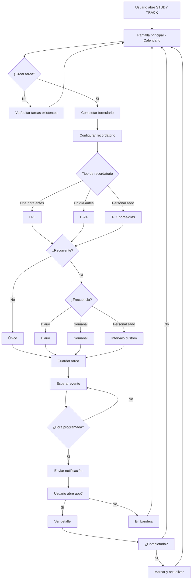
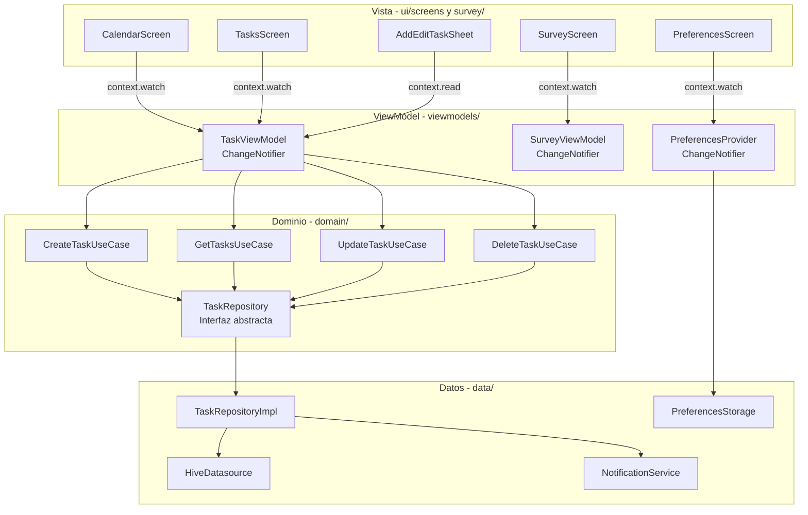
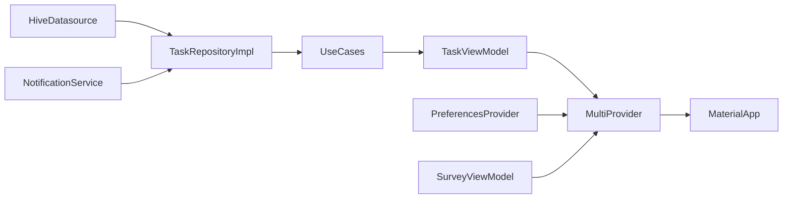
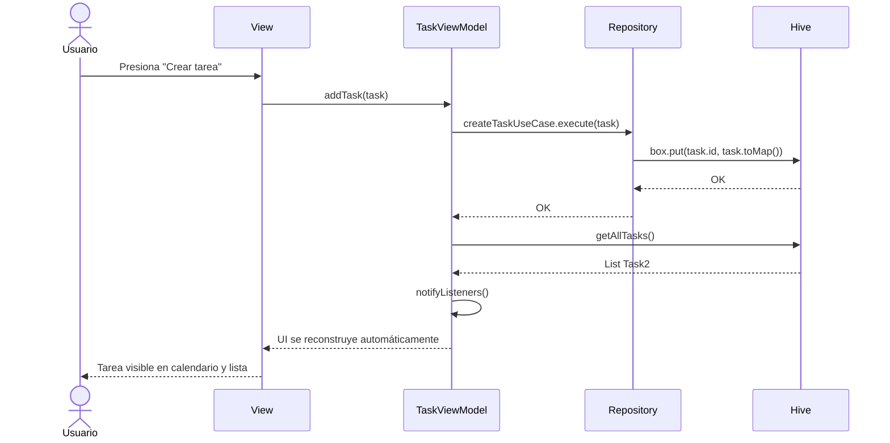
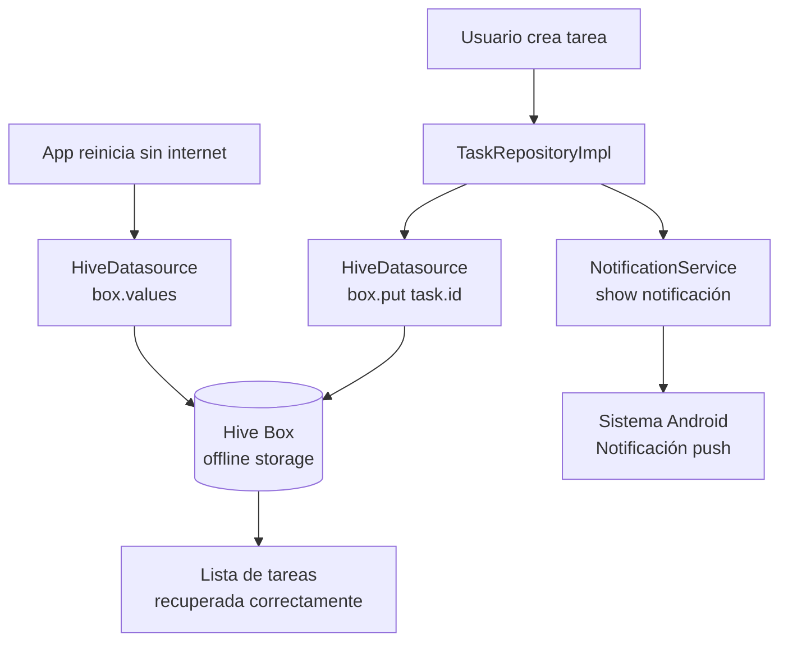
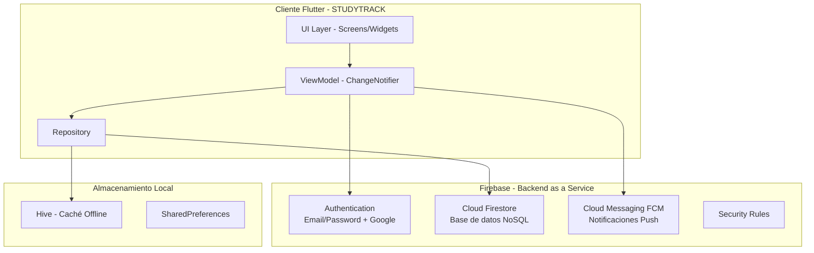
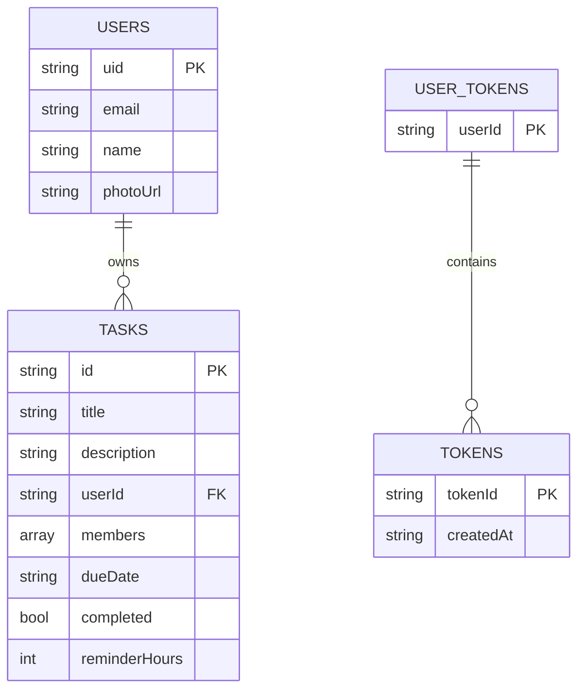

# STUDYTRACK

## Descripcion del Proyecto

**STUDYTRACK** es una aplicación móvil diseñada para estudiantes que se les dificulta la gestión de su tiempo de estudio, causando sobrecarga académica, atrasos y procrastinación. La app permite registrar tareas y evaluaciones en un calendario interactivo, asignar fechas límite y recibir notificaciones de recordatorio, mejorando el rendimiento aadémico mediante una organización efectiva.

## Características Propias del Movil

La solución aprovecha las siguientes capacidades del móvil:

- **Ubicuidad**: Acceso desde cualquier lugar sin necesidad de una computadora o laptop pesada. 

- **Notificaciones Push**: Alertas automáticas para recordar fechas límite y hábitos de estudio.

- **Personalización**: Configuración de horarios y preferencias de recordatorios.

- **Modo Offline**: Visualización y edición básica sin conexión a internet. 

## Requerimientos

### Historias de Usuaio

| ID | Historia de Usuario
|----|--------------------|
| HE-01 | Como estudiante, quiero registrar un título, descripción y fecha límite para no olvidar mis tareas. |
| HE-02 | Como estudiante, quiero ver mis tareas en un calendario mensual para visualizar mi carga académica. |
| HE-03 | Como estudiate, quiero recibir notificaciones de recordatorio personalizadas a la tarea para organizar el orden y tiempo que les dedico. |
| HE-04 | Como estudiante, quiero marcar tareas como completadas para hacer seguimiento de mi progreso. |
| HE-05 | Como estudiante, quiero editar y eliminar tareas en caso de cambio en mis fechas de evaluación. |

### Requerimientos Funcionales

- **RF-01**: El sistema debe permitir crear, leer, actualizar y eliminar tareas.

- **RF-02**: El sistema debe mostrar un calendario interactivo con las tareas asignadas a cada fecha.

- **RF-03**: El sistema debe enviar notificaciones push en fechas y horas configurables.

### Requerimientos No Funcionales

- **RNF-01**: La aplicación debe funcionar sin conexión a internet.

- **RNF-02**: Las notificaciones deben entregarse con un retraso máximo de 5 segundos respecto a lo programado.

- **RNF-03**: La aplicación debe estar disponible para iOS y Android con el mismo código base.

## Diagrama de Caso de Uso Principal

**Caso de Uso Principal**: Registrar Nueva Tarea y Configurar Notificación

```mermaid
graph TD
    A[Usuario abre STUDY TRACK] --> B[Pantalla principal - Calendario];
    B --> C{¿Crear tarea?};
    
    C -->|No| D[Ver/editar tareas existentes];
    D --> B;
    
    C -->|Sí| E[Completar formulario];
    E --> F[Configurar recordatorio];
    
    F --> G{Tipo de recordatorio};
    
    G -->|Una hora antes| H[H-1];
    G -->|Un día antes| I[H-24];
    G -->|Personalizado| J[T- X horas/días];
    
    H --> K{¿Recurrente?};
    I --> K;
    J --> K;
    
    K -->|No| L[Único];
    K -->|Sí| M{¿Frecuencia?};
    
    M -->|Diario| N[Diario];
    M -->|Semanal| O[Semanal];
    M -->|Personalizado| P[Intervalo custom];
    
    L --> Q[Guardar tarea];
    N --> Q;
    O --> Q;
    P --> Q;
    
    Q --> R[Esperar evento];
    R --> S{¿Hora programada?};
    
    S -->|Sí| T[Enviar notificación];
    S -->|No| R;
    
    T --> U[Usuario abre app?];
    U -->|Sí| V[Ver detalle];
    U -->|No| W[En bandeja];
    
    V --> X[¿Completada?];
    X -->|Sí| Y[Marcar y actualizar];
    X -->|No| B;
    
    Y --> B;
    W --> B;
```

## Investigación

Este proyecto incluye un análisis de aplicaciones similares y el detalle técnico de implementación de las funcionalidades móviles.

📄 [Ir a RESEARCH.md](./RESEARCH.md)


## Instrucciones de Uso

- **1** : Al abrir la aplicación, se mostrará la pantalla principal (Home), donde se presenta una vista general de la aplicación y sus funciones principales.

- **2** : Desde la pantalla inicial, el usuario podrá acceder a las distintas secciones mediante los botones de navegación disponibles.

### 3 : Sección Calendario:
    - Permite visualizar fechas importantes relacionadas con actividades académicas.
    - Próximamente incorporará tareas organizadas por día.

### 4 : Sección Tareas:
    - Muestra una lista de tareas pendientes y completadas.
    - Permite revisar entregas próximas y organización personal.

- ### 5: Sección Acerca de :
    - Presentación de información general del proyecto y sus principales características

- **6** : Para desplazarse entre pantallas, utilice los botones del menú o los accesos disponibles en cada vista.

- **7** : El botón flotante con símbolo + permitirá agregar nuevas tareas o eventos en futuras versiones.

## Arquitectura y Patrones

### Arquitectura del Proyecto

La aplicación STUDYTRACK está desarrollada utilizando el framework Flutter y sigue una arquitectura modular basada en la separación de responsabilidades.

La estructura del proyecto se organiza de la siguiente manera:

```text
lib/
├── models/
│   └── task.dart
├── ui/
│   ├── screens/
│   │   ├── calendar_screen.dart
│   │   ├── tasks_screen.dart
│   │   ├── task_detail_screen.dart
│   │   ├── about_screen.dart
│   │   ├── help_screen.dart
│   │   └── profile_screen.dart
│   └── widgets/
│       ├── task_card.dart
│       └── feature_card.dart
└── main.dart
```
###  Justificación de la estructura

#### models/
Contiene la representación de datos del sistema:
- **Ejemplo:** `Task`
- Define atributos como título, descripción y fecha límite
- Independiente de la UI

Esto permite que la lógica de datos pueda reutilizarse o cambiar su fuente (por ejemplo, base de datos o API) sin afectar la interfaz.

#### ui/screens/
Contiene todas las pantallas principales de la aplicación. Cada archivo representa una vista completa:
- `calendar_screen.dart` → vista principal (Home)
- `tasks_screen.dart` → lista de tareas
- `task_detail_screen.dart` → detalle de tarea
- `about_screen.dart`, `help_screen.dart`, `profile_screen.dart` → pantallas informativas

Separar por pantallas mejora la organización y facilita la navegación.

#### 🔹 ui/widgets/
Contiene componentes reutilizables:
- `task_card.dart` → representación visual de una tarea
- `feature_card.dart` → elementos informativos

 Evita duplicación de código y mantiene consistencia visual.

#### 🔹 main.dart
Punto de entrada de la aplicación:
- Configura el tema global (ThemeData)
- Define rutas nombradas (routes)
- Controla la navegación principal

### Patrón de Diseño

Se aplica una arquitectura inspirada en separación por capas (similar a MVVM simplificado):

| Capa | Ubicación |
|------|-----------|
| **Modelo (Model)** | `models/` |
| **Vista (View)** | `screens/` y `widgets/` |
| **Control de navegación y estado básico** | `main.dart` + `Navigator` |

Aunque no se implementa un ViewModel formal, la separación permite escalar fácilmente hacia patrones más robustos en el futuro (Provider, Riverpod, BLoC).

### Jerarquía de Navegación

La aplicación utiliza navegación basada en **rutas nombradas** mediante el widget `Navigator` de Flutter.

#### Ruta inicial

La pantalla principal es el calendario

Estructura de Navegación:

```text
Calendar (Home)
 ├── Tasks
 │    └── Task Detail
 ├── About
 ├── Profile
 └── Help
```

##### Tipo de Navegación
    - Navegación No Lineal
    - Acceso a Múltiples Pantallas Desde la Barra Superior (AppBar)
    - Uso de Navigator.pushNamed para transiciones

Esto permite que el usuario pueda moverse libremente entre secciones sin seguir un flujo rigido

#### Justificación de la navegación

| Beneficio | Explicacion
|----|--------------------|
| Acceso rápido | Todas las pantallas son accesibles desde el AppBar |
| Experiencia flexible | El usuario no depende de un flujo secuencial |
| Escalabilidad | Se pueden agregar nuevas rutas fácilmente en main.dart |	

#### Decisiones técnicas clave
- Uso de rutas nombradas para centralizar la navegación

- Separación clara entre datos (models) y UI (screens/widgets)

- Componentización mediante widgets reutilizables

- Estructura preparada para futuras mejoras:

- Integración de base de datos (Hive/sqflite)

- Notificaciones push (flutter_local_notifications)

- Manejo de estado avanzado (Provider, Riverpod, BLoC)


## Identidad Digital

### Package Name

cl.Pereira.STUDYTRACK

### App Icon

El proyecto utiliza un icono personalizado representativo de la gestión académica y organización de tareas.

### Paleta de Colores

| Color | Uso |
|---------|---------|
| Primario | Navegación principal |
| Secundario | Botones de acción |
| Fondo | Pantallas |
| Acento | Indicadores visuales |

La paleta fue definida utilizando Material Theme Builder para mantener consistencia visual en toda la aplicación.

## Arquitectura MVVM e Inyección de Dependencias

### Implementación MVVM

La aplicación implementa el patrón **Model-View-ViewModel** con separación estricta entre capas. Ninguna pantalla accede directamente a Hive o al servicio de notificaciones — todo pasa por el ViewModel.


```mermaid
graph TD
    subgraph VIEW ["Vista - ui/screens y survey/"]
        CS[CalendarScreen]
        TS[TasksScreen]
        SS[SurveyScreen]
        PS[PreferencesScreen]
        AE[AddEditTaskSheet]
    end

    subgraph VIEWMODEL ["ViewModel - viewmodels/"]
        TVM[TaskViewModel\nChangeNotifier]
        SVM[SurveyViewModel\nChangeNotifier]
        PPR[PreferencesProvider\nChangeNotifier]
    end

    subgraph DOMAIN ["Dominio - domain/"]
        TR[TaskRepository\nInterfaz abstracta]
        CU[CreateTaskUseCase]
        GU[GetTasksUseCase]
        UU[UpdateTaskUseCase]
        DU[DeleteTaskUseCase]
    end

    subgraph DATA ["Datos - data/"]
        TRI[TaskRepositoryImpl]
        HD[HiveDatasource]
        NS[NotificationService]
        PRS[PreferencesStorage]
    end

    CS -->|context.watch| TVM
    TS -->|context.watch| TVM
    AE -->|context.read| TVM
    SS -->|context.watch| SVM
    PS -->|context.watch| PPR

    TVM --> CU & GU & UU & DU
    CU & GU & UU & DU --> TR
    TR --> TRI
    TRI --> HD
    TRI --> NS
    PPR --> PRS
```

### Inyección de Dependencias

Las dependencias se construyen en `main.dart` antes de iniciar la UI y se inyectan mediante `MultiProvider`:


```mermaid
graph LR
    A[HiveDatasource] --> C
    B[NotificationService] --> C
    C[TaskRepositoryImpl] --> D[UseCases]
    D --> E[TaskViewModel]
    E --> G[MultiProvider]
    F[PreferencesProvider] --> G
    H[SurveyViewModel] --> G
    G --> I[MaterialApp]
```

```dart
// main.dart — construcción explícita del árbol de dependencias
final repository = TaskRepositoryImpl(
  hiveDatasource: HiveDatasource(),
  notificationService: notificationService,
);

MultiProvider(
  providers: [
    ChangeNotifierProvider(create: (_) => TaskViewModel(
      createTaskUseCase: CreateTaskUseCase(repository),
      getTasksUseCase:   GetTasksUseCase(repository),
      updateTaskUseCase: UpdateTaskUseCase(repository),
      deleteTaskUseCase: DeleteTaskUseCase(repository),
    )),
    ChangeNotifierProvider(create: (_) => PreferencesProvider()..loadPreferences()),
    ChangeNotifierProvider(create: (_) => SurveyViewModel(SurveyLoader())..loadQuestions()),
  ],
)
```

### Flujo de datos reactivo


```mermaid
sequenceDiagram
    actor U as Usuario
    participant V as View
    participant VM as TaskViewModel
    participant R as Repository
    participant H as Hive

    U->>V: Presiona "Crear tarea"
    V->>VM: addTask(task)
    VM->>R: createTaskUseCase.execute(task)
    R->>H: box.put(task.id, task.toMap())
    H-->>R: OK
    R-->>VM: OK
    VM->>H: getAllTasks()
    H-->>VM: List Task2
    VM->>VM: notifyListeners()
    VM-->>V: UI se reconstruye automáticamente
    V-->>U: Tarea visible en calendario y lista
```

### Diagrama PoC — Offline First y Notificaciones

La Prueba de Concepto validó la integración asíncrona entre Hive y flutter_local_notifications antes de incorporarla a la rama principal:


```mermaid
graph TD
    A[Usuario crea tarea] --> B[TaskRepositoryImpl]
    B --> C[HiveDatasource\nbox.put task.id]
    B --> D[NotificationService\nshow notificación]
    C --> E[(Hive Box\noffline storage)]
    D --> F[Sistema Android\nNotificación push]
    
    G[App reinicia sin internet] --> H[HiveDatasource\nbox.values]
    H --> E
    E --> I[Lista de tareas\nrecuperada correctamente]
```

**Resultado de la PoC:** Se validó que Hive persiste correctamente sin conexión y que `flutter_local_notifications` v21 requiere parámetros nombrados en su API (`id:`, `title:`, `body:`, `notificationDetails:`).

---

## Reporte de QA — Beta Testing

### Instrumento de evaluación

Encuesta de 8 preguntas (escala 1–5) cargada desde `assets/questions.json` y presentada dentro de la app. Al completarla, el usuario envía sus respuestas al correo del equipo mediante un Intent `mailto:` nativo.

### Usuarios evaluadores

| Tipo | Cantidad |
|------|----------|
| Participantes Digital Workspace Mobility | 6 |
| Conocedores de la industria | 2 |
| Externos a la industria | 2 |
| Usuarios adicionales | 3 |
| **Total** | **13** |

### Resultados Obtenidos

Se recopilaron 13 evaluaciones completas utilizando la encuesta integrada en la aplicación.

| Usuario | Nav. | Gestión | Interfaz | Calendario | Notif. | Recomend. | Offline | Satisf. | **Total** |
|---------|------|---------|----------|------------|--------|-----------|---------|---------|-----------|
| U-01 | 5 | 5 | 5 | 5 | 5 | 4 | 5 | 5 | **39/40** |
| U-02 | 4 | 4 | 5 | 5 | 5 | 5 | 4 | 4 | **36/40** |
| U-03 | 5 | 5 | 5 | 5 | 3 | 5 | 5 | 5 | **38/40** |
| U-04 | 5 | 5 | 5 | 5 | 5 | 5 | 5 | 5 | **40/40** |
| U-05 | 5 | 4 | 5 | 4 | 4 | 5 | 5 | 5 | **37/40** |
| U-06 | 4 | 4 | 4 | 4 | 5 | 4 | 5 | 3 | **33/40** |
| U-07 | 5 | 5 | 4 | 4 | 5 | 5 | 5 | 5 | **38/40** |
| U-08 | 5 | 5 | 5 | 5 | 5 | 5 | 5 | 5 | **40/40** |
| U-09 | 5 | 5 | 5 | 5 | 5 | 5 | 5 | 5 | **40/40** |
| U-10 | 4 | 5 | 4 | 5 | 5 | 4 | 5 | 5 | **37/40** |
| U-11 | 5 | 5 | 5 | 5 | 5 | 5 | 5 | 5 | **40/40** |
| U-12 | 5 | 5 | 5 | 5 | 5 | 4 | 5 | 5 | **39/40** |
| U-13 | 4 | 5 | 5 | 5 | 5 | 4 | 4 | 4 | **36/40** |
| **Promedio** | **4.69** | **4.77** | **4.77** | **4.77** | **4.77** | **4.62** | **4.85** | **4.69** | **38.69/40** |

**Promedio general: 38.69 / 40 · Satisfacción: 96.7%**

### Análisis por pregunta

| Dimensión | Promedio | Observación |
|-----------|----------|-------------|
| Navegación | 4.69 / 5 | Interfaz intuitiva y fácil de recorrer |
| Gestión de tareas | 4.77 / 5 | CRUD sin errores reportados |
| Interfaz gráfica | 4.77 / 5 | Diseño atractivo y coherente |
| Calendario | 4.77 / 5 | Visualización de carga académica efectiva |
| Notificaciones | 4.77 / 5 | Un usuario evaluó con 3 — pendiente mejorar configuración |
| Recomendación | 4.62 / 5 | Dimensión con menor puntaje — potencial de mejora en difusión |
| Funcionamiento offline | 4.85 / 5 | Resultado más alto — persistencia Hive validada |
| Satisfacción general | 4.69 / 5 | Alta aceptación general |

### Análisis Ejecutivo

Los resultados evidencian una **alta aceptación de StudyTrack** por parte de los 13 usuarios participantes. La aplicación alcanzó un promedio de **38.69 puntos sobre 40**, equivalente a un **96.7% de satisfacción general**, superando significativamente el resultado de la primera ronda de evaluaciones.

#### Qué funcionó correctamente

- **Funcionamiento offline** obtuvo el puntaje más alto (4.85/5) — la persistencia con Hive fue validada exitosamente por todos los usuarios.
- **Gestión de tareas, interfaz y calendario** obtuvieron 4.77/5 — el CRUD completo funcionó sin errores reportados.
- **4 usuarios otorgaron puntaje perfecto** (40/40), indicando una experiencia sin fricciones.
- La navegación mediante NavigationBar inferior fue calificada como intuitiva por la mayoría.

#### Qué mejorar

- **Notificaciones** (4.77/5) — un usuario evaluó con 3/5, indicando que la experiencia de los recordatorios puede mejorarse. 
- **Recomendación** (4.62/5) — la dimensión con menor puntaje. Esto sugiere que la aplicación aún tiene margen de mejora. 

### Technical Debt y Trabajos Futuros

| Prioridad | Mejora | Origen |
|-----------|--------|--------|
| Alta | Notificaciones con más opciones de personalización | Evaluación notificaciones |
| Alta | Sincronización Firebase Firestore | ADR / deuda técnica |
| Media | Categorías o etiquetas por asignatura | Feedback usuarios |


## Material de Apoyo

https://youtu.be/nnMGWF5fdSc

## APK

El APK de la aplicación está disponible en la raíz del repositorio para instalación directa en Android.

**Archivo:** `studytrack-v1.0.0.apk`

Para generar un nuevo APK desde el código fuente:

```bash
flutter build apk --release --target-platform android-arm64
```

> Para instalar el APK en un dispositivo Android ve a **Ajustes → Aplicaciones → (la app desde donde abres el archivo) → Permitir de esta fuente**.


 ## Backend as a Service

 ### Diagrama BaaS


```mermaid
 graph TD
    subgraph CLIENT["Cliente Flutter - STUDYTRACK"]
        UI[UI Layer - Screens/Widgets]
        VM[ViewModel - ChangeNotifier]
        R[Repository]
    end

    subgraph BAAS["Firebase - Backend as a Service"]
        A[Authentication\nEmail/Password + Google]
        F[Cloud Firestore\nBase de datos NoSQL]
        C[Cloud Messaging FCM\nNotificaciones Push]
        S[Security Rules]
    end

    subgraph LOCAL["Almacenamiento Local"]
        H[Hive - Caché Offline]
        P[SharedPreferences]
    end

    UI --> VM
    VM --> R
    R --> F
    R --> H
    VM --> A
    VM --> C
```

## Estructura de Base de Datos

Utilizamos una base de datos NoSQL


```mermaid
erDiagram
    USERS ||--o{ TASKS : owns
    USER_TOKENS ||--o{ TOKENS : contains

    USERS {
        string uid PK
        string email
        string name
        string photoUrl
    }

    TASKS {
        string id PK
        string title
        string description
        string userId FK
        array members
        string dueDate
        bool completed
        int reminderHours
    }

    USER_TOKENS {
        string userId PK
    }

    TOKENS {
        string tokenId PK
        string createdAt
    }
```

## Reglas de Seguridad Firestore

javascript
rules_version = '2';
service cloud.firestore {
  match /databases/{database}/documents {
    
    match /users/{userId} {
      allow read: if request.auth != null;
      allow write: if request.auth != null && request.auth.uid == userId;
      
      match /tasks/{taskId} {
        allow read: if request.auth != null &&
          (request.auth.uid == userId || 
           request.auth.uid in resource.data.members);
        
        allow create: if request.auth != null &&
          request.auth.uid == userId &&
          request.resource.data.userId == userId;
        
        allow update: if request.auth != null &&
          (request.auth.uid == userId || 
           request.auth.uid in resource.data.members);
        
        allow delete: if request.auth != null &&
          request.auth.uid == userId;
      }
    }
    
    match /{document=**} {
      allow read, write: if false;
    }
  }
}

### Justificación de Reglas
| Regla | |Propósito|
|-----------|---------|
| allow read: if request.auth != null |	Usuarios autenticados pueden ver perfiles públicos |
| allow write: if request.auth.uid == userId |	Solo el usuario modifica su perfil |
| allow read: if request.auth.uid in resource.data.members | Dueño y miembros comparten lectura de tareas |
| allow create: if request.auth.uid == userId | Solo el dueño crea tareas en su colección |
| allow update: if request.auth.uid in resource.data.members | Dueño y miembros actualizan tareas |
| allow delete: if request.auth.uid == userId | Solo el dueño elimina tareas |

## Manual de Despliegue

### Prerrequisitos

Antes de ejecutar el proyecto, asegúrate de tener instalado lo siguiente:

| Herramienta | Versión recomendada |
|--------------|--------------------|
| Flutter SDK | 3.16.0 o superior |
| Dart SDK | Incluido con Flutter |
| Firebase CLI | 13.0 o superior |
| Android Studio | 2023.1 o superior |
| Git | Última versión |

---

### Paso 1: Configurar Firebase

1. Crear un nuevo proyecto en **Firebase Console**.
2. Registrar la aplicación Android (e iOS si corresponde).
3. Habilitar **Firebase Authentication** con los proveedores:
   - Email y contraseña.
   - Google Sign-In.
4. Crear una base de datos **Cloud Firestore**.
5. Habilitar **Firebase Cloud Messaging (FCM)**.

---

### Paso 2: Agregar los archivos de configuración

Descargar los archivos de configuración desde Firebase Console.

#### Android

Colocar el archivo:

```text
android/app/google-services.json
```

#### iOS

Colocar el archivo:

```text
ios/Runner/GoogleService-Info.plist
```

---

### Paso 3: Instalar dependencias

Desde la carpeta raíz del proyecto ejecutar:

```bash
flutter pub get
```

---

### Paso 4: Configurar Firebase CLI

Instalar Firebase CLI:

```bash
npm install -g firebase-tools
```

Iniciar sesión:

```bash
firebase login
```

Inicializar Firestore (solo la primera vez):

```bash
firebase init firestore
```

Desplegar las reglas de seguridad:

```bash
firebase deploy --only firestore:rules
```

---

### Paso 5: Configurar Firebase Cloud Messaging (FCM)

#### Android

Obtener la huella SHA-1:

```bash
cd android
./gradlew signingReport
```

Agregar la SHA-1 obtenida en la configuración del proyecto de Firebase.

#### iOS

Configurar APNs desde Firebase Console y subir el certificado correspondiente.

---

### Paso 6: Ejecutar la aplicación

#### Modo desarrollo

```bash
flutter run
```

---

### Paso 7: Generar la aplicación

#### APK de producción

```bash
flutter build apk --release --target-platform android-arm64
```

#### Android App Bundle (Google Play)

```bash
flutter build appbundle --release
```

---

### Dependencias principales

El proyecto utiliza las siguientes tecnologías:

- Flutter
- Provider
- Firebase Authentication
- Cloud Firestore
- Firebase Cloud Messaging
- Hive
- Shared Preferences
- Google Sign-In
- Flutter Local Notifications
- Timezone
- Share Plus

---

### Configuración adicional

Antes de ejecutar la aplicación, verificar que:

- El proyecto esté correctamente conectado con Firebase.
- Las reglas de Firestore hayan sido desplegadas.
- Authentication tenga habilitado Email/Password y Google Sign-In.
- Cloud Messaging esté configurado correctamente.
- El archivo `google-services.json` (Android) o `GoogleService-Info.plist` (iOS) se encuentre en la ubicación correspondiente.
- Se hayan instalado todas las dependencias mediante `flutter pub get`.
